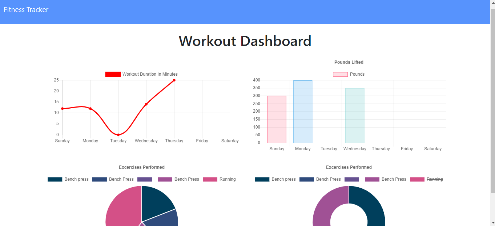

# workoutTracker

## User Story

- As a user, I want to be able to view create and track daily workouts. I want to be able to log multiple exercises in a workout on a given day. I should also be able to track the name, type, weight, sets, reps, and duration of exercise. If the exercise is a cardio exercise, I should be able to track my distance traveled.

## Submission on BCS

You are required to submit the following:

- The URL to the deployed application
  https://glacial-eyrie-34834.herokuapp.com/

- The URL to the Github repository
  https://github.com/Findjules2/workoutTracker

